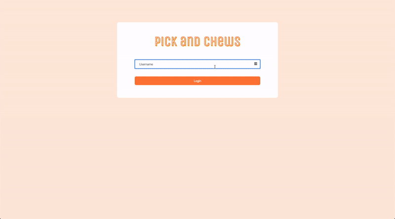

## This is the Frontend of Pick and Chews
You will need the Frontend and the Backend in order to make the web app work
[Pick and Chews Backend](https://github.com/jolouie7/Pick-and-Chews-app-backend)

# Pick and Chews

Social web app to help indecisive individuals find a place to eat

## Technologies used
Ruby on Rails, SQLite3, Javascript

## Features
- Applying filters for restaurants
- Rendering Yelp page using an Iframe
- Getting restaurant data, using Yelp API

# Demo


## Installation
> Installation assumes that you are using OS X or Linux
> We will also be using homebrew. Recommend to install [Homebrew](https://brew.sh/)
> Installations will be for both frontend and backend

### Backend Installation
Make a new directory, then change into that directory. Within that directory:

Clone the project on your local machine
```bash
git clone git@github.com:jolouie7/Pick-and-Chews-app-backend.git
```
Change into the webuy-backend directory
```bash
cd Pick-and-Chews-app-backend
cd pick-and-chews-backend
```
Install dependencies by using [bundler](https://bundler.io/guides/rails.html)
```bash
bundle install
```

Create your database and migrate
```bash
rails db:create
rails db:migrate
```
Start your rails server
```bash
rails s
```

### FrontEnd Installation
Within the direcrory that holds your Pick-and-Chews-app-backend but not in Pick-and-Chews-app-backend:

Clone the project on your local machine
```bash
git clone git@github.com:jolouie7/Pick-and-Chews-app-frontend.git
```
Change into the Pick-and-Chews-app-frontend directory
```bash
cd Pick-and-Chews-app-frontend
```

## To run the web app
Go to index.html, right click on the file and click open in default browser

## Features to add in the future
- Add Last Visited
- Add Top Favorited

## Contributing
Pull requests are welcome. For major changes, please open an issue first to discuss what you would like to change.

## License
[MIT](https://choosealicense.com/licenses/mit/)